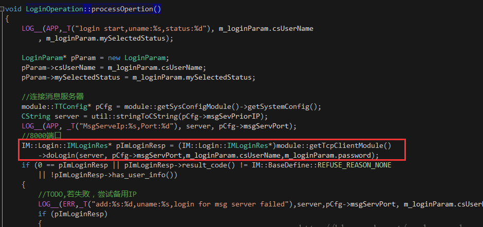
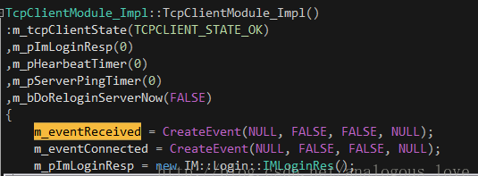

# 客户端网络库

---

teamtalk客户端与服务端共用同一套网络库，但为了实现跨平台等特性做了部分封装，

本章会对两者共同之处的网络库进行源码分析，对客户端和服务端网络库细微的不同之处进行单独分析，理清思路，

### 1.网络库中的类：

1. CBaseSocket：套接字操作类，保存套接字状态和操作的方法、回调函数（读写关闭回调），listen和connect时都设置回调，
    等事件分发器检测有事件的时候，调用相关的回调函数
2. CEventDispatch：事件分发器类，封装处理事件循环，处理io操作，和检测定时任务，处理事件回调（调用CBaseSocket中的响应函数）
3. CImConn :: 封装对套接字连接的操作，有自己的接收发送缓冲区，可以设置回调
4. CImPdu :: 消息操作类，封装有关protobuf消息结构的操作方法
5. netlib :: 封装有关socket操作的函数,提供外部调用的接口
6. CSimpleBuffer :: 缓冲区类，封装了对自定义缓冲区的操作方法
7. CByteStream :: 字节流类，封装了对simpleBuffer的操作方法
8. http_parser：http基础操作结构体
9. CHttpParserWrapper :: 封装http有关方法的类

### 2.IO框架重要类

#### CBaseSocket

CBaseSocket中拥有句柄，还有事件处理器(注册的回调函数m_callback)

#### CEventDispatch事件分发器

CEventDispatch事件分发器和Reactor，该类中调用select或epoll循环等待事件发生并处理，添加和删除事件

#### 事件处理器和具体事件处理器

事件处理器为CImConn，通过注册imconn_callback到CBaseSocket中，进行回调事件处理器，

而具体事件处理器，客户端和服务端有些不太一样，

- 服务端：事件处理器为继承CImConn的类，重写相关业务逻辑函数。
- 客户端：CImConn中增加ITcpSocketCallback*成员变量，实际是指向TcpClientModule_Impl的指针，主要是为了与客户端做一个组件化操作

#### 网络库数据收发关系

从高层到底层是这样，

只举发送数据调用层级 `ImCore::send()->CImConn::send()->netlib_send()->CSocket::send()->(::send)` 中

`netlib` 和 `ImCore` 都封装了一些提供访问和操作网络库的接口，客户端是通过ImCore来进行调用，服务端则是在继承ImCore后直接使用netlib的接口进行数据的发送接收

### 3.网络库数据包流程

#### （1）公共事件分发器

```cpp
void CEventDispatch::StartDispatch(uint32_t wait_timeout)
{
    fd_set read_set, write_set, excep_set;
    timeval timeout;
    timeout.tv_sec = 1;    //wait_timeout 1 second
    timeout.tv_usec = 0;
    while (running)
    {
        //_CheckTimer();
        //_CheckLoop();
        if (!m_read_set.fd_count && !m_write_set.fd_count && !m_excep_set.fd_count)
        {
            Sleep(MIN_TIMER_DURATION);
            continue;
        }
        m_lock.lock();
        FD_ZERO(&read_set);
        FD_ZERO(&write_set);
        FD_ZERO(&excep_set);
        memcpy(&read_set, &m_read_set, sizeof(fd_set));
        memcpy(&write_set, &m_write_set, sizeof(fd_set));
        memcpy(&excep_set, &m_excep_set, sizeof(fd_set));
        m_lock.unlock();
        if (!running)
            break;
        //for (int i = 0; i < read_set.fd_count; i++) {
        //    LOG__(NET,  "read fd: %d\n", read_set.fd_array[i]);
        //}
        int nfds = select(0, &read_set, &write_set, &excep_set, &timeout);
        if (nfds == SOCKET_ERROR)
        {
            //LOG__(NET,  "select failed, error code: %d\n", GetLastError());
            Sleep(MIN_TIMER_DURATION);
            continue;            // select again
        }
        if (nfds == 0)
        {
            continue;
        }
        for (u_int i = 0; i < read_set.fd_count; i++)
        {
            //LOG__(NET,  "select return read count=%d\n", read_set.fd_count);
            SOCKET fd = read_set.fd_array[i];
            CBaseSocket* pSocket = FindBaseSocket((net_handle_t)fd);
            if (pSocket)
            {
                pSocket->OnRead();
                pSocket->ReleaseRef();
            }
        }
        for (u_int i = 0; i < write_set.fd_count; i++)
        {
            //LOG__(NET,  "select return write count=%d\n", write_set.fd_count);
            SOCKET fd = write_set.fd_array[i];
            CBaseSocket* pSocket = FindBaseSocket((net_handle_t)fd);
            if (pSocket)
            {
                pSocket->OnWrite();
                pSocket->ReleaseRef();
            }
        }
        for (u_int i = 0; i < excep_set.fd_count; i++)
        {
            LOG__(NET,  _T("select return exception count=%d"), excep_set.fd_count);
            SOCKET fd = excep_set.fd_array[i];
            CBaseSocket* pSocket = FindBaseSocket((net_handle_t)fd);
            if (pSocket)
            {
                pSocket->OnClose();
                pSocket->ReleaseRef();
            }
        }
    }
}
```

#### （2）句柄所对应的事件处理器

句柄所对应的事件处理器pSocket->OnRead()，

上述分发器代码是window下的，linux下的类似，在这个函数中select等待事件的发生，有事件则调用对应句柄所对应的事件处理器，如pSocket->OnRead()

```cpp
void CBaseSocket::OnRead()
{
    if (m_state == SOCKET_STATE_LISTENING)
    {
        //这个服务端才有，如果socket句柄是lisent时使用的句柄，检测到客户端有新连接过来会调用
        _AcceptNewSocket();
    }
    else
    {
        u_long avail = 0;
        if ( (ioctlsocket(m_socket, FIONREAD, &avail) == SOCKET_ERROR) || (avail == 0) )
        {
            //m_callback保存imconn.h中的imconn_callback地址
            m_callback(m_callback_data, NETLIB_MSG_CLOSE, (net_handle_t)m_socket, NULL);
        }
        else
        {
            m_callback(m_callback_data, NETLIB_MSG_READ, (net_handle_t)m_socket, NULL);
        }
    }
}
```

#### （3）新连接接收

`_AcceptNewSocket();`

在客户端有新链接来时会调用，增加新的会话链接CImConn，并将回调函数 `imconn_callback` 保存 `CBaseSocket` 的m_callback中，

如果该链接是非监听状态，则调用之前注册的回调imconn_callback

```cpp
void imconn_callback(void* callback_data, uint8_t msg, uint32_t handle, void* pParam)
{
    NOTUSED_ARG(handle);
    NOTUSED_ARG(pParam);
    CImConn* pConn = TcpSocketsManager::getInstance()->get_client_conn(handle);
    if (!pConn)
    {
        //LOG__(NET, _T("connection is invalied:%d"), handle);
        return;
    }
    pConn->AddRef();
    //    LOG__(NET,  "msg=%d, handle=%d\n", msg, handle);
    switch (msg)
    {
    case NETLIB_MSG_CONFIRM:
        pConn->onConnect();
        break;
    case NETLIB_MSG_READ:
        pConn->OnRead();
        break;
    case NETLIB_MSG_WRITE:
        pConn->OnWrite();
        break;
    case NETLIB_MSG_CLOSE:
        pConn->OnClose();
        break;
    default:
        LOG__(NET,  _T("!!!imconn_callback error msg: %d"), msg);
        break;
    }
    pConn->ReleaseRef();
}
```

#### （4）事件处理

事件处理pConn->OnRead()，

上述代码为windows下的，linux下服务端代码类似，这里举有数据到来举例，有数据的过来的时候调用这个回调，通过选择相应的分支 pConn->OnRead();

```cpp
void CImConn::OnRead()
{
    for (;;)
    {
        uint32_t free_buf_len = m_in_buf.GetAllocSize() - m_in_buf.GetWriteOffset();
        if (free_buf_len < READ_BUF_SIZE)
            m_in_buf.Extend(READ_BUF_SIZE);
        int ret = netlib_recv(m_handle, m_in_buf.GetBuffer() + m_in_buf.GetWriteOffset(), READ_BUF_SIZE);
        if (ret <= 0)
            break;
        m_in_buf.IncWriteOffset(ret);
        while (m_in_buf.GetWriteOffset() >= imcore::HEADER_LENGTH)
        {
            uint32_t len = m_in_buf.GetWriteOffset();
            uint32_t length = CByteStream::ReadUint32(m_in_buf.GetBuffer());
            if (length > len)
                break;
            try
            {
                imcore::TTPBHeader pbHeader;
                pbHeader.unSerialize((byte*)m_in_buf.GetBuffer(), imcore::HEADER_LENGTH);
                LOG__(NET, _T("OnRead moduleId:0x%x,commandId:0x%x"), pbHeader.getModuleId(), pbHeader.getCommandId());
                if (m_pTcpSocketCB)
                    //在这个进行相应的业务逻辑处理
                    m_pTcpSocketCB->onReceiveData((const char*)m_in_buf.GetBuffer(), length);
                LOGBIN_F__(SOCK, "OnRead", m_in_buf.GetBuffer(), length);
            }
            catch (std::exception& ex)
            {
                assert(FALSE);
                LOGA__(NET, "std::exception,info:%s", ex.what());
                if (m_pTcpSocketCB)
                    m_pTcpSocketCB->onReceiveError();
            }
            catch (...)
            {
                assert(FALSE);
                LOG__(NET, _T("unknown exception"));
                if (m_pTcpSocketCB)
                    m_pTcpSocketCB->onReceiveError();
            }
            m_in_buf.Read(NULL, length);
        }
    }
}
```

#### （5）OnRead函数

客户端和服务端的CImConn::OnRead()流程类似，先解包，然后再进行调用业务逻辑处理函数，

只不过客户端是，m_pTcpSocketCB->onReceiveData，服务端是重写CImConn::HandlePdu()

- 客户端：

```cpp
void TcpClientModule_Impl::onReceiveData(const char* data, int32_t size)
{
    if (m_pServerPingTimer)
        m_pServerPingTimer->m_bHasReceivedPing = TRUE;
    imcore::TTPBHeader header;
    header.unSerialize((byte*)data, imcore::HEADER_LENGTH);    
    if (IM::BaseDefine::CID_OTHER_HEARTBEAT == header.getCommandId() && IM::BaseDefine::SID_OTHER == header.getModuleId())
    {
        //模块器端过来的心跳包，不跳到业务层派发
        return;
    }
    LOG__(NET, _T("receiveData message moduleId:0x%x,commandId:0x%x")
        , header.getModuleId(), header.getCommandId());
    if (g_seqNum == header.getSeqNumber())
    {
        m_pImLoginResp->ParseFromArray(data + imcore::HEADER_LENGTH, size - imcore::HEADER_LENGTH);
        ::SetEvent(m_eventReceived);
        return;
    }
    //将网络包包装成任务放到逻辑任务队列里面去
    _handlePacketOperation(data, size);
}

//m_pTcpSocketCB->onReceiveData客户端一般数据是TcpClientModule_Impl::onReceiveData这收取，文件传输数据使用的是文件传输模块的onReceiveData，暂且不提，在这个函数中，获取数据包中的serviceID和cmdID，根据不同serviceID选择相应模块的实例

void TcpClientModule_Impl::_handlePacketOperation(const char* data, UInt32 size)
{
    std::string copyInBuffer(data, size);
    imcore::IMLibCoreStartOperationWithLambda(
        [=]()
    {
        imcore::TTPBHeader header;
        header.unSerialize((byte*)copyInBuffer.data(),imcore::HEADER_LENGTH);
        module::IPduPacketParse* pModule
            = (module::IPduPacketParse*)__getModule(header.getModuleId());
        if (!pModule)
        {
            assert(FALSE);
            LOG__(ERR, _T("module is null, moduleId:%d,commandId:%d")
                , header.getModuleId(), header.getCommandId());
            return;
        }
        std::string pbBody(copyInBuffer.data() + imcore::HEADER_LENGTH, size - imcore::HEADER_LENGTH);
        pModule->onPacket(header, pbBody);
    });
}

//不同模块都重写了onPacket函数，根据cmdID的不同来选择相应的业务处理函数，如
void GroupListModule_Impl::onPacket(imcore::TTPBHeader& header, std::string& pbBody)
{
    switch (header.getCommandId())
    {
    case IM::BaseDefine::CID_GROUP_NORMAL_LIST_RESPONSE :
        _groupNormalListResponse(pbBody);
        break;
    case IM::BaseDefine::CID_GROUP_INFO_RESPONSE:
        _groupInfoResponse(pbBody);
        break;
    case IM::BaseDefine::CID_GROUP_CREATE_RESPONSE:
        _groupCreateDiscussGroupResponse(pbBody);
        break;
    case IM::BaseDefine::CID_GROUP_CHANGE_MEMBER_RESPONSE:
        _groupChangedGroupMembersResponse(pbBody);
        break;
    case IM::BaseDefine::CID_GROUP_SHIELD_GROUP_RESPONSE:
        _groupShieldResponse(pbBody);
        break;
    case IM::BaseDefine::CID_GROUP_CHANGE_MEMBER_NOTIFY:
        _groupChangeMemberNotify(pbBody);
        break;
    default:
        break;
    }
}
```

- 服务端：回到上面服务端重写CImConn::HandlePdu()流程，例如

```cpp
void CLoginConn::HandlePdu(CImPdu* pPdu)
{
 switch (pPdu->GetCommandId()) {
        case CID_OTHER_HEARTBEAT:
            break;
        case CID_OTHER_MSG_SERV_INFO:
            _HandleMsgServInfo(pPdu);
            break;
        case CID_OTHER_USER_CNT_UPDATE:
            _HandleUserCntUpdate(pPdu);
            break;
        case CID_LOGIN_REQ_MSGSERVER:
            _HandleMsgServRequest(pPdu);
            break;
        default:
            log("wrong msg, cmd id=%d ", pPdu->GetCommandId());
            break;
     }
}
```


### 4.收包发包流程总结

#### （1）客户端收发包

**发包**

1. TcpClientModule_Impl::sendPacket()->_sendPacket()组包头和包体，包头有对应的serviceID和cmid还有包的总长度，包体是真正的业务结构数据，序列化后发送
2. 调用IMLibCoreWrite()将组好的包给CImConn发送
3. CImConn::Send()发送不出去就在自己的缓存中保存，监听写事件，可写时将数据发送出去，就用netlib_send()
4. netlib_send()找出对应socket的CBaseSocket，调用CBaseSocket::Send()发送数据
5. CBaseSocket::Send()则调用相应系统底层的send()函数，进行数据发送

**收包**

1. 事件分发器监听事件的发生，有读事件发生，根据socket句柄，调用拥有该句柄的CBaseSocket的OnRead()函数
2. CBaseSocket::OnRead()有数据调用回调函数imconn_callback()（函数中的_AcceptNewSocket上面已做说明，不再解释）
3. imconn_callback()中判断是读是写数据，调用CImConn::OnRead()
4. CImConn::OnRead()中调用onReceiveData()进行整个包的数据的读取，并调用TcpClientModule_Impl::_handlePacketOperation()
5. _handlePacketOperation（）中封装一个操作函数到lambda操作类中放入逻辑处理队列（逻辑队列的概念后续章节再讲，目前先清楚这个lambda表达式会被调用即可）
6. lambda表达式中根据header.getModuleId调用相应的模块，并将包体从包中解出，将包头和包体都传给相应模块的业务函数onPacket()
7. onPacket在各个模块中根据命令号，来进行相应的业务处理

#### （2）服务端收发包

举消息服务器回应心跳的例子，都其他服务器都差不多

**发包**

1. CMsgConn::_HandleHeartBeat(CImPdu *pPdu)中直接将客户端发过来的心跳数据发回去，调用父类CImConn::SendPdu()
2. CImConn::SendPdu()调用CimConn::Send()，后面发送的流程就跟客户端一样
3. CImConn::Send()发送不出去就在自己的缓存中保存，监听写事件，可写时将数据发送出去，就用netlib_send()
4. netlib_send()找出对应socket的CBaseSocket，调用CBaseSocket::Send()发送数据
5. CBaseSocket::Send()则调用相应系统底层的send()函数，进行数据发送

**收包**

服务端收包前三步跟客户端一样，直接复制

1. 事件分发器监听事件的发生，有读事件发生，根据socket句柄，调用拥有该句柄的CBaseSocket的OnRead()函数
2. CBaseSocket::OnRead()有数据调用回调函数imconn_callback()（函数中的_AcceptNewSocket上面已做说明，不再解释）
3. imconn_callback()中判断是读是写数据，调用CImConn::OnRead()
4. CImConn::OnRead()根据调用子类中重写的HandlePdu（）函数，然后根据各自业务逻辑选择相应函数

本章主要针对客户端和服务端共同的网络库，进行分析，

还有些缓冲区等也想放在这个章节分析，但两端采用的是不同的事件触发模式，客户端采用select水平触发模式(LT)，服务端采用epoll的边沿触发模式(ET)，所以就放到后面分别单独讲述


### 网络通信

其它的没什么好介绍的，我们来重点介绍下第3点和第4点。先说第3点，在第3点中又会牵扯出第4点，网络通信线程的启动：

```cpp
bool IMLibCoreRunEvent() {	
	LOG__(NET, _T("==============================================================================="));
 
	//在这里启动任务队列处理线程
	getOperationManager()->startup();
 
	CAutoLock lock(&g_lock);
	if (!netlib_is_running()) {
#ifdef _MSC_VER
		unsigned int m_dwThreadID;
		//在这里启动网络IO线程
		g_hThreadHandle = (HANDLE)_beginthreadex(0, 0, event_run, 0, 0, (unsigned*)&m_dwThreadID);
		if (g_hThreadHandle < (HANDLE)2)
		{
			m_dwThreadID = 0;
			g_hThreadHandle = 0;
		}
		return g_hThreadHandle >(HANDLE)1;
#else
		pthread_t pt;
		pthread_create(&pt, NULL, event_run, NULL);
#endif
	}
 
	return true;
}
```

getOperationManager()->startup()：先看getOperationManager()->startup();

```cpp
IMCoreErrorCode OperationManager::startup()
{
	m_operationThread = std::thread([&]
	{
		std::unique_lock <std::mutex> lck(m_cvMutex);
		Operation* pOperation = nullptr;
		while (m_bContinue)
		{
			if (!m_bContinue)
				break;
			if (m_vecRealtimeOperations.empty())
				m_CV.wait(lck);
			if (!m_bContinue)
				break;
			{
				std::lock_guard<std::mutex> lock(m_mutexOperation);
				if (m_vecRealtimeOperations.empty())
					continue;
				pOperation = m_vecRealtimeOperations.front();
				m_vecRealtimeOperations.pop_front();
			}
 
			if (!m_bContinue)
				break;
 
			if (pOperation)
			{
				pOperation->process();
				pOperation->release();
			}
		}
	});
 
	return IMCORE_OK;
}
```

这里利用一个C++11的新语法lamda表达式来创建一个线程，线程函数就是lamda表达式的具体内容：先从队列中取出任务，然后执行。所有的任务都继承其基类Operation，而Operation又继承接口类IOperatio，任务类根据自己具体需要做什么来改写process()方法：

```cpp
class NETWORK_DLL Operation : public IOperation
{
	enum OperationState
	{
		OPERATION_IDLE = 0,
		OPERATION_STARTING,
		OPERATION_RUNNING,
		OPERATION_CANCELLING,
		OPERATION_FINISHED
	};
 
public:
    /** @name Constructors and Destructor*/
 
    //@{
    /**
     * Constructor 
     */
    Operation();
	Operation(const std::string& name);
    /**
     * Destructor
     */
    virtual ~Operation();
    //@}
 
public:
	virtual void processOpertion() = 0;
 
public:
	virtual void process();
	virtual void release();
 
    inline std::string name() const { return m_name; }
    inline void set_name(__in std::string name){ m_name = name; }
 
private:
	OperationState			m_state;
    std::string				m_name;
};
```

```cpp
struct NETWORK_DLL IOperation
{
public:
	virtual void process() = 0;
//private:
	/**
	* 必须让容器来释放自己
	*
	* @return  void
	* @exception there is no any exception to throw.
	*/
	virtual void release() = 0;
};
```

这里我们介绍的任务队列我们称为队列A，下文中还有一个专门做http请求的队列，我们称为队列B。

后半部分代码其实就是启动网络检测线程，检测网络数据读写：

```
g_hThreadHandle = (HANDLE)_beginthreadex(0, 0, event_run, 0, 0, (unsigned*)&m_dwThreadID);
```

```cpp
unsigned int __stdcall event_run(void* threadArgu)
{
	LOG__(NET,  _T("event_run"));
	netlib_init();
	netlib_set_running();
	netlib_eventloop();
	return NULL;
}
```

```cpp
void netlib_eventloop(uint32_t wait_timeout)
{
	CEventDispatch::Instance()->StartDispatch(wait_timeout);
}
```

```cpp
void CEventDispatch::StartDispatch(uint32_t wait_timeout)
{
	fd_set read_set, write_set, excep_set;
	timeval timeout;
	timeout.tv_sec = 1;	//wait_timeout 1 second
	timeout.tv_usec = 0;
 
    while (running)
	{
		//_CheckTimer();
		//_CheckLoop();
 
		if (!m_read_set.fd_count && !m_write_set.fd_count && !m_excep_set.fd_count)
		{
			Sleep(MIN_TIMER_DURATION);
			continue;
		}
 
		m_lock.lock();
		FD_ZERO(&read_set);
		FD_ZERO(&write_set);
		FD_ZERO(&excep_set);
		memcpy(&read_set, &m_read_set, sizeof(fd_set));
		memcpy(&write_set, &m_write_set, sizeof(fd_set));
		memcpy(&excep_set, &m_excep_set, sizeof(fd_set));
		m_lock.unlock();
 
		if (!running)
			break;
 
		//for (int i = 0; i < read_set.fd_count; i++) {
		//	LOG__(NET,  "read fd: %d\n", read_set.fd_array[i]);
		//}
		int nfds = select(0, &read_set, &write_set, &excep_set, &timeout);
		if (nfds == SOCKET_ERROR)
		{
			//LOG__(NET,  "select failed, error code: %d\n", GetLastError());
			Sleep(MIN_TIMER_DURATION);
			continue;			// select again
		}
		if (nfds == 0)
		{
			continue;
		}
		for (u_int i = 0; i < read_set.fd_count; i++)
		{
			//LOG__(NET,  "select return read count=%d\n", read_set.fd_count);
			SOCKET fd = read_set.fd_array[i];
			CBaseSocket* pSocket = FindBaseSocket((net_handle_t)fd);
			if (pSocket)
			{
				pSocket->OnRead();
				pSocket->ReleaseRef();
			}
		}
		for (u_int i = 0; i < write_set.fd_count; i++)
		{
			//LOG__(NET,  "select return write count=%d\n", write_set.fd_count);
			SOCKET fd = write_set.fd_array[i];
			CBaseSocket* pSocket = FindBaseSocket((net_handle_t)fd);
			if (pSocket)
			{
				pSocket->OnWrite();
				pSocket->ReleaseRef();
			}
		}
		for (u_int i = 0; i < excep_set.fd_count; i++)
		{
			LOG__(NET,  _T("select return exception count=%d"), excep_set.fd_count);
			SOCKET fd = excep_set.fd_array[i];
			CBaseSocket* pSocket = FindBaseSocket((net_handle_t)fd);
			if (pSocket)
			{
				pSocket->OnClose();
				pSocket->ReleaseRef();
			}
		}
	}
}
```

我们举个具体的例子来说明这个三个线程的逻辑（任务队列A、网络线程和下文要介绍的专门处理http请求的任务队列B）和代理窗口的消息队列，以在登录对话框输入用户名和密码后接下来的步骤：

```cpp
//位于LoginDialog.cpp中
void LoginDialog::_DoLogin()
{
	LOG__(APP,_T("User Clicked LoginBtn"));
 
	m_ptxtTip->SetText(_T(""));
	CDuiString userName = m_pedtUserName->GetText();
	CDuiString password = m_pedtPassword->GetText();
	if (userName.IsEmpty())
	{
		CString csTip = util::getMultilingual()->getStringById(_T("STRID_LOGINDIALOG_USERNAME_EMPTY"));
		m_ptxtTip->SetText(csTip);
		return;
	}
	if (password.IsEmpty())
	{
		CString csTip = util::getMultilingual()->getStringById(_T("STRID_LOGINDIALOG_PASSWORD_EMPTY"));
		m_ptxtTip->SetText(csTip);
		return;
	}
	module::TTConfig* pCfg = module::getSysConfigModule()->getSystemConfig();
	pCfg->userName = userName;
	if (m_bPassChanged)
	{
		std::string sPass = util::cStringToString(CString(password));
		char* pOutData = 0;
		uint32_t nOutLen = 0;
		int retCode = EncryptPass(sPass.c_str(), sPass.length(), &pOutData, nOutLen);
		if (retCode == 0 && nOutLen > 0 && pOutData != 0)
		{
			pCfg->password = std::string(pOutData, nOutLen);
			Free(pOutData);
		}
		else
		{
			LOG__(ERR, _T("EncryptPass Failed!"));
			CString csTip = util::getMultilingual()->getStringById(_T("STRID_LOGINDIALOG_LOGIN_ENCRYPT_PASE_FAIL"));
			m_ptxtTip->SetText(csTip);			
			return;
		}
	}
 
	pCfg->isRememberPWD = m_pChkRememberPWD->GetCheck();
	module::getSysConfigModule()->saveData();
 
	CString csTxt = util::getMultilingual()->getStringById(_T("STRID_LOGINDIALOG_BTN_DOLOGIN"));
	m_pBtnLogin->SetText(csTxt);
	m_pBtnLogin->SetEnabled(false);
 
	//连接登陆服务器
	DoLoginServerParam param;
	DoLoginServerHttpOperation* pOper = new DoLoginServerHttpOperation(
		BIND_CALLBACK_1(LoginDialog::OnHttpCallbackOperation), param);
	module::getHttpPoolModule()->pushHttpOperation(pOper);
}
```

点击登录按钮之后，程序先对用户名和密码进行一些有效性校验，接着产生一个DoLoginServerHttpOperation对象，该类继承IHttpOperation，IHttpOperation再继承ICallbackOpertaion，ICallbackOpertaion再继承Operation类。这个任务会绑定一个任务完成之后的回调函数，即宏BIND_CALLBACK_1，这个宏实际上就是std::bind：

```
#define BIND_CALLBACK_1(func)   std::bind(&func, this, placeholders::_1)
#define BIND_CALLBACK_2(func)	std::bind(&func, this, placeholders::_1, placeholders::_2)
```

往任务队列中放入任务的动作如下：

```
void HttpPoolModule_Impl::pushHttpOperation(module::IHttpOperation* pOperaion, BOOL bHighPriority /*= FALSE*/)
{
	if (NULL == pOperaion)
	{
		return;
	}
 
	CAutoLock lock(&m_mtxLock);
	if (bHighPriority)
		m_lstHttpOpers.push_front(pOperaion);
	else
		m_lstHttpOpers.push_back(pOperaion);
	_launchThread();
	::ReleaseSemaphore(m_hSemaphore, 1, NULL);
 
	return;
}
```

其中_launchThread()会启动一个线程，该线程函数是另外一个任务队列，专门处理http任务：

```
BOOL HttpPoolModule_Impl::_launchThread()
{
	if ((int)m_vecHttpThread.size() >= MAX_THEAD_COUNT)
	{
		return TRUE;
	}
 
	TTHttpThread* pThread = new TTHttpThread();
	PTR_FALSE(pThread);
	if (!pThread->create())
	{
		return FALSE;
	}
	Sleep(300);
 
	m_vecHttpThread.push_back(pThread);
 
	return TRUE;
}
```

线程函数最终实际执行代码如下：

```
UInt32 TTHttpThread::process()
{
	module::IHttpOperation * pHttpOper = NULL;
	HttpPoolModule_Impl *pPool = m_pInstance;
	while (m_bContinue)
	{
		if (WAIT_OBJECT_0 != ::WaitForSingleObject(pPool->m_hSemaphore, INFINITE))
		{
			break;
		}
 
		if (!m_bContinue)
		{
			break;
		}
 
		{
			CAutoLock lock(&(pPool->m_mtxLock));
			if (pPool->m_lstHttpOpers.empty())
				pHttpOper = NULL;
			else
			{
				pHttpOper = pPool->m_lstHttpOpers.front();
				pPool->m_lstHttpOpers.pop_front();
			}
		}
 
		try
		{
			if (m_bContinue && pHttpOper)
			{
				pHttpOper->process();
				pHttpOper->release();
			}
		}
		catch (...)
		{
			LOG__(ERR, _T("TTHttpThread: Failed to execute opertaion(0x%p)"), pHttpOper);
		}
	}
 
	return 0;
}
```

当这个http任务被任务队列执行时，实际执行DoLoginServerHttpOperation::processOpertion()，代码如下：

```
void DoLoginServerHttpOperation::processOpertion()
{
	module::TTConfig* pCfg = module::getSysConfigModule()->getSystemConfig();
	LOG__(APP, _T("loginAddr = %s"), pCfg->loginServIP);
	std::string& loginAddr = util::cStringToString(pCfg->loginServIP);
	std::string url = loginAddr;
	
	DoLoginServerParam* pPamram = new DoLoginServerParam();
	pPamram->resMsg = util::getMultilingual()->getStringById(_T("STRID_LOGINDIALOG_LOGIN_HTTP_DEFERROR"));
	Http::HttpResponse	response;
	Http::HttpClient	client;
    //对于登录：url=http://192.168.226.128:8080/msg_server
	Http::HttpRequest	request("get", url);
	if (!client.execute(&request, &response))
	{
		CString csTemp = util::stringToCString(url);
		pPamram->result = DOLOGIN_FAIL;
		LOG__(ERR,_T("failed %s"), csTemp);
		asyncCallback(std::shared_ptr<void>(pPamram));
		client.killSelf();
		return;
	}
    /**
        {
           "backupIP" : "localhost",
           "code" : 0,
           "discovery" : "http://127.0.0.1/api/discovery",
           "msfsBackup" : "http://127.0.0.1:8700/",
           "msfsPrior" : "http://127.0.0.1:8700/",
           "msg" : "",
           "port" : "8000",
           "priorIP" : "localhost"
        }
     */
	std::string body = response.getBody();
	client.killSelf();
	//json解析
	try
	{
		Json::Reader reader;
		Json::Value root;
		if (!reader.parse(body, root))
		{
			CString csTemp = util::stringToCString(body);
			LOG__(ERR, _T("parse data failed,%s"), csTemp);
			pPamram->result = DOLOGIN_FAIL;
			pPamram->resMsg = util::getMultilingual()->getStringById(_T("STRID_LOGINDIALOG_LOGIN_HTTP_JSONERROR"));
			goto End;
		}
		int nCode = root.get("code", "").asInt();
		if (0 == nCode)//登陆成功
		{
			LOG__(APP, _T("get msgSvr IP succeed!"));
			pCfg->msgSevPriorIP = root.get("priorIP", "").asString();
			pCfg->msgSevBackupIP = root.get("backupIP", "").asString();
			std::string strPort = root.get("port", "").asString();
			pCfg->msgServPort = util::stringToInt32(strPort);
 
			pCfg->fileSysAddr = util::stringToCString(root.get("msfsPrior", "").asString());
			pCfg->fileSysBackUpAddr = util::stringToCString(root.get("msfsBackup", "").asString());
			pPamram->result = DOLOGIN_SUCC;
		}
		else
		{
			LOG__(ERR, _T("get msgSvr IP failed! Code = %d"),nCode);
			pPamram->result = DOLOGIN_FAIL;
			CString csRetMsgTemp = util::stringToCString(root.get("msg", "").asString());
			if (!csRetMsgTemp.IsEmpty())
				pPamram->resMsg = csRetMsgTemp;
		}
	}
	catch (...)
	{
		CString csTemp = util::stringToCString(body);
		LOG__(ERR,_T("parse json execption,%s"), csTemp);
		pPamram->result = DOLOGIN_FAIL;
		pPamram->resMsg = util::getMultilingual()->getStringById(_T("STRID_LOGINDIALOG_LOGIN_HTTP_JSONERROR"));
	}
 
End:
	asyncCallback(std::shared_ptr<void>(pPamram));
}
```

实际上是向login_server发送一个http请求，这是一个同步请求。得到的结果是一个json字符串，代码注释中已经给出。然后调用asyncCallback(std::shared_ptr<void>(pPamram));参数pPamram携带了当前任务的回调函数指针：

```
/**
* 异步回调，借助UIEvent
*
* @param   std::shared_ptr<void> param
* @return  void
* @exception there is no any exception to throw.
*/
 
void asyncCallback(std::shared_ptr<void> param)
{
	CallbackOperationEvent* pEvent = new CallbackOperationEvent(m_callback, param);
	module::getEventManager()->asynFireUIEvent(pEvent);
}
```

这实际上产生了一个回调事件。也就是说队列B做http请求，操作完成后往代理窗口的消息队列中放入一个回调事件，这个事件通过代理窗口过程函数来处理的（这就是上文中第4点介绍的代理窗口过程的作用，实际上是利用windows消息队列来做任务处理（系统有现成的任务队列系统，为何不利用呢？））：

```
module::IMCoreErrorCode UIEventManager::asynFireUIEvent(IN const IEvent* const pEvent)
{
	assert(m_hWnd);
	assert(pEvent);
	if (0 == m_hWnd || 0 == pEvent)
		return IMCORE_ARGUMENT_ERROR;
 
	if (FALSE == ::PostMessage(m_hWnd, UI_EVENT_MSG, reinterpret_cast<WPARAM>(this), reinterpret_cast<WPARAM>(pEvent)))
		return IMCORE_WORK_POSTMESSAGE_ERROR;
 
	return IMCORE_OK;
}
```

看到没有？向代理窗口的消息队列中投递一个UI_EVENT_MSG事件，并在消息参数LPARAM中传递了回调事件的对象指针。这样代理窗口过程函数就可以处理这个消息了：

```cpp
LRESULT _stdcall UIEventManager::_WindowProc(HWND hWnd
											, UINT message
											, WPARAM wparam
											, LPARAM lparam)
{
	switch (message)
	{
	case UI_EVENT_MSG:
		reinterpret_cast<UIEventManager*>(wparam)->_processEvent(reinterpret_cast<IEvent*>(lparam), TRUE);
		break;
	case WM_TIMER:
		reinterpret_cast<UIEventManager*>(wparam)->_processTimer();
		break;
	default:
		break;
	}
	return ::DefWindowProc(hWnd, message, wparam, lparam);
}
```

```cpp
void UIEventManager::_processEvent(IEvent* pEvent, BOOL bRelease)
{
	assert(pEvent);
	if (0 == pEvent)
		return;
 
	try
	{
		pEvent->process();
		if (bRelease)
			pEvent->release();
	}
	catch (imcore::Exception *e)
	{
		LOG__(ERR, _T("event run exception"));
		pEvent->onException(e);
		if (bRelease)
			pEvent->release();
		if (e)
		{
			LOG__(ERR, _T("event run exception:%s"), util::stringToCString(e->m_msg));
			assert(FALSE);
		}
	}
	catch (...)
	{
		LOG__(ERR, _T("operation run exception,unknown reason"));
		if (bRelease)
			pEvent->release();
		assert(FALSE);
	}
}
```

根据C++的多态特性，pEvent->process()实际上调用的是CallbackOperationEvent.process()。代码如下：

```
	virtual void process()
	{
		m_callback(m_param);
	}
```

m_callback(m_param);调用的就是上文中介绍DoLoginServerHttpOperation操作的回调函数LoginDialog::OnHttpCallbackOperation()：

```
void LoginDialog::OnHttpCallbackOperation(std::shared_ptr<void> param)
{
	DoLoginServerParam* pParam = (DoLoginServerParam*)param.get();
	if (DOLOGIN_SUCC == pParam->result)
	{
		module::TTConfig* pCfg = module::getSysConfigModule()->getSystemConfig();
		PTR_VOID(pCfg);
		LoginParam loginparam;
		loginparam.csUserName = pCfg->userName;
		loginparam.password = pCfg->password;
		loginparam.csUserName.Trim();
		LoginOperation* pOperation = new LoginOperation(
			BIND_CALLBACK_1(LoginDialog::OnOperationCallback), loginparam);
		imcore::IMLibCoreStartOperation(pOperation);
	}
	else
	{
		m_ptxtTip->SetText(pParam->resMsg);
		module::TTConfig* pCfg = module::getSysConfigModule()->getSystemConfig();
		LOG__(ERR, _T("get MsgServer config faild,login server addres:%s:%d"), pCfg->loginServIP,pCfg->loginServPort);
 
		CString csTxt = util::getMultilingual()->getStringById(_T("STRID_LOGINDIALOG_BTN_LOGIN"));
		m_pBtnLogin->SetText(csTxt);
		m_pBtnLogin->SetEnabled(true);
	}
}
```

ok，终于到家了。但是这并没结束，我们只介绍了队列B和代理窗口消息队列，还有队列A呢？LoginDialog::OnHttpCallbackOperation()会根据获取的msg_server的情况来再次产生一个新的任务LoginOperation来放入队列A中，这次才是真正的用户登录，根据上面的介绍，LoginOperation任务从队列A中取出来之后，实际执行的是LoginOperation::processOpertion()：

```
void LoginOperation::processOpertion()
{
	LOG__(APP,_T("login start,uname:%s,status:%d"), m_loginParam.csUserName
		, m_loginParam.mySelectedStatus);
 
	LoginParam* pParam = new LoginParam;
	pParam->csUserName = m_loginParam.csUserName;
	pParam->mySelectedStatus = m_loginParam.mySelectedStatus;
 
	//连接消息服务器
	module::TTConfig* pCfg = module::getSysConfigModule()->getSystemConfig();
	CString server = util::stringToCString(pCfg->msgSevPriorIP);
	LOG__(APP, _T("MsgServeIp:%s,Port:%d"), server, pCfg->msgServPort);
    //8000端口
	IM::Login::IMLoginRes* pImLoginResp = (IM::Login::IMLoginRes*)module::getTcpClientModule()
		->doLogin(server, pCfg->msgServPort,m_loginParam.csUserName,m_loginParam.password);
	if (0 == pImLoginResp || pImLoginResp->result_code() != IM::BaseDefine::REFUSE_REASON_NONE 
		|| !pImLoginResp->has_user_info())
	{
		//TODO,若失败，尝试备用IP
		LOG__(ERR,_T("add:%s:%d,uname:%s,login for msg server failed"),server,pCfg->msgServPort, m_loginParam.csUserName);
		if (pImLoginResp)
		{
			CString errInfo = util::stringToCString(pImLoginResp->result_string());
			pParam->errInfo = errInfo;
			pParam->result = LOGIN_FAIL;
			pParam->server_result = pImLoginResp->result_code();
			LOG__(ERR, _T("error code :%d,error info:%s"), pImLoginResp->result_code(), errInfo);
		}
		else
		{
			pParam->result = IM::BaseDefine::REFUSE_REASON_NO_MSG_SERVER;
			LOG__(ERR, _T("login msg server faild！"));
		}
		asyncCallback(std::shared_ptr<void>(pParam));
		return;
	}
	pParam->result = LOGIN_OK;
	pParam->serverTime = pImLoginResp->server_time();
	pParam->mySelectedStatus = pImLoginResp->online_status();
 
	//存储服务器端返回的userId
	IM::BaseDefine::UserInfo userInfo = pImLoginResp->user_info();
	pCfg->userId = util::uint32ToString(userInfo.user_id());
	pCfg->csUserId = util::stringToCString(pCfg->userId);
 
	//登陆成功，创建自己的信息
	module::UserInfoEntity myInfo;
	myInfo.sId = pCfg->userId;
	myInfo.csName = m_loginParam.csUserName;
	myInfo.onlineState = IM::BaseDefine::USER_STATUS_ONLINE;
	myInfo.csNickName = util::stringToCString(userInfo.user_nick_name());
	myInfo.avatarUrl = userInfo.avatar_url();
	myInfo.dId = util::uint32ToString(userInfo.department_id());
	myInfo.department = myInfo.dId;
	myInfo.email = userInfo.email();
	myInfo.gender = userInfo.user_gender();
	myInfo.user_domain = userInfo.user_domain();
	myInfo.telephone = userInfo.user_tel();
	myInfo.status = userInfo.status();
    myInfo.signature = userInfo.sign_info();
 
	module::getUserListModule()->createUserInfo(myInfo);
 
	asyncCallback(std::shared_ptr<void>(pParam));
 
	LOG__(APP, _T("login succeed! Name = %s Nickname = %s sId = %s status = %d")
		, m_loginParam.csUserName
		, util::stringToCString(userInfo.user_nick_name())
		, module::getSysConfigModule()->UserID()
		, m_loginParam.mySelectedStatus);
 
	//开始发送心跳包
	module::getTcpClientModule()->startHeartbeat();
}
```

同理，数据包发生成功以后，会再往代理窗口的消息队列中产生一个回调事件，最终调用刚才说的LoginOperation绑定的回调函数：

```
void asyncCallback(std::shared_ptr<void> param)
{
	CallbackOperationEvent* pEvent = new CallbackOperationEvent(m_callback, param);
	module::getEventManager()->asynFireUIEvent(pEvent);
}
```

```
void LoginDialog::OnOperationCallback(std::shared_ptr<void> param)
{
	LoginParam* pLoginParam = (LoginParam*)param.get();
 
 
    if (LOGIN_OK == pLoginParam->result)	//登陆成功
	{
		Close(IDOK);
 
		//创建用户目录
		_CreateUsersFolder();
 
		//开启同步消息时间timer
		module::getSessionModule()->startSyncTimeTimer();
		module::getSessionModule()->setTime(pLoginParam->serverTime);
 
		//通知服务器客户端初始化完毕,获取组织架构信息和群列表
		module::getLoginModule()->notifyLoginDone();
	}
	else	//登陆失败处理
	{
		module::getTcpClientModule()->shutdown();
		if (IM::BaseDefine::REFUSE_REASON_NO_MSG_SERVER == pLoginParam->server_result)
		{
			CString csTip = util::getMultilingual()->getStringById(_T("STRID_LOGINDIALOG_LOGIN_MSGSVR_FAIL"));
			m_ptxtTip->SetText(csTip);
		}
		else if (!pLoginParam->errInfo.IsEmpty())
		{
			m_ptxtTip->SetText(pLoginParam->errInfo);
		}
		else
		{
			CString errorCode = util::int32ToCString(pLoginParam->server_result);
			CString csTip = util::getMultilingual()->getStringById(_T("STRID_LOGINDIALOG_LOGIN_UNKNOWN_ERROR"));
			m_ptxtTip->SetText(csTip + CString(":") + errorCode);
		}
	}
 
	CString csTxt = util::getMultilingual()->getStringById(_T("STRID_LOGINDIALOG_BTN_LOGIN"));
	m_pBtnLogin->SetText(csTxt);
	m_pBtnLogin->SetEnabled(true);
}
```

至此，登录才成功。等等，那数据包是怎么发到服务器的呢？这也是一个重点，我们来详细地介绍一下，LoginOperation::processOpertion()中有这一行代码：

doLogin函数代码如下：



```
IM::Login::IMLoginRes* TcpClientModule_Impl::doLogin(CString &linkaddr, UInt16 port
	,CString& uName,std::string& pass)
{
	m_socketHandle = imcore::IMLibCoreConnect(util::cStringToString(linkaddr), port);
	imcore::IMLibCoreRegisterCallback(m_socketHandle, this);
	if(util::waitSingleObject(m_eventConnected, 5000))
	{
		IM::Login::IMLoginReq imLoginReq;
		string& name = util::cStringToString(uName);
		imLoginReq.set_user_name(name);
		imLoginReq.set_password(pass);
		imLoginReq.set_online_status(IM::BaseDefine::USER_STATUS_ONLINE);
		imLoginReq.set_client_type(IM::BaseDefine::CLIENT_TYPE_WINDOWS);
		imLoginReq.set_client_version("win_10086");
 
		if (TCPCLIENT_STATE_OK != m_tcpClientState)
			return 0;
 
		sendPacket(IM::BaseDefine::SID_LOGIN, IM::BaseDefine::CID_LOGIN_REQ_USERLOGIN, ++g_seqNum
			, &imLoginReq);
		m_pImLoginResp->Clear();
		util::waitSingleObject(m_eventReceived, 10000);
	}
 
	return m_pImLoginResp;
}
```

这段代码先连接服务器，然后调用sendPacket()发送登录数据包。如何连接服务器使用了一些“奇技淫巧”，我们后面单独介绍。我们这里先来看sendPacket()发包代码：

```
void TcpClientModule_Impl::sendPacket(UInt16 moduleId, UInt16 cmdId, UInt16 seq, google::protobuf::MessageLite* pbBody)
{
	m_TTPBHeader.clear();
	m_TTPBHeader.setModuleId(moduleId);
	m_TTPBHeader.setCommandId(cmdId);
	m_TTPBHeader.setSeqNumber(seq);
 
	_sendPacket(pbBody);
}
```

```
void TcpClientModule_Impl::_sendPacket(google::protobuf::MessageLite* pbBody)
{
	UInt32 length = imcore::HEADER_LENGTH + pbBody->ByteSize();
	m_TTPBHeader.setLength(length);
	std::unique_ptr<byte> data(new byte[length]);
	memset(data.get(), 0, length);
	memcpy(data.get(), m_TTPBHeader.getSerializeBuffer(), imcore::HEADER_LENGTH);
	if (!pbBody->SerializeToArray(data.get() + imcore::HEADER_LENGTH, pbBody->ByteSize()))
	{
		LOG__(ERR, _T("pbBody SerializeToArray failed"));
		return;
	}
	imcore::IMLibCoreWrite(m_socketHandle, data.get(), length);
}
```

其实就是序列化成protobuf要求的格式，然后调用imcore::IMLibCoreWrite(m_socketHandle, data.get(), length);发出去：

```
int IMLibCoreWrite(int key, uchar_t* data, uint32_t size)
{
	int nRet = -1;
	int nHandle = key;
	CImConn* pConn = TcpSocketsManager::getInstance()->get_client_conn(nHandle);
	if (pConn) {
		pConn->Send((void*)data, size);
	}
	else {
		LOG__(NET,  _T("connection is invalied:%d"), key);
	}
 
	return nRet;
}
```

先尝试着直接发送，如果目前tcp窗口太小发不出去，则暂且将数据放在发送缓冲区里面，并检测socket可写事件。这里就是和服务器一样的网络库的代码了，前面一系列的文章，我们已经介绍过了。

```
int CImConn::Send(void* data, int len)
{
	if (m_busy)
	{
		m_out_buf.Write(data, len);
		return len;
	}
 
	int offset = 0;
	int remain = len;
	while (remain > 0) {
		int send_size = remain;
		if (send_size > NETLIB_MAX_SOCKET_BUF_SIZE) {
			send_size = NETLIB_MAX_SOCKET_BUF_SIZE;
		}
 
		int ret = netlib_send(m_handle, (char*)data + offset, send_size);
		if (ret <= 0) {
			ret = 0;
			break;
		}
 
		offset += ret;
		remain -= ret;
	}
 
	if (remain > 0)
	{
		m_out_buf.Write((char*)data + offset, remain);
		m_busy = true;
		LOG__(NET,  _T("send busy, remain=%d"), m_out_buf.GetWriteOffset());
	}
 
	return len;
}
```

数据发出去以后，服务器应答登录包，网络线程会检测到socket可读事件：

```
void CBaseSocket::OnRead()
{
	if (m_state == SOCKET_STATE_LISTENING)
	{
		_AcceptNewSocket();
	}
	else
	{
		u_long avail = 0;
		if ( (ioctlsocket(m_socket, FIONREAD, &avail) == SOCKET_ERROR) || (avail == 0) )
		{
			m_callback(m_callback_data, NETLIB_MSG_CLOSE, (net_handle_t)m_socket, NULL);
		}
		else
		{
			m_callback(m_callback_data, NETLIB_MSG_READ, (net_handle_t)m_socket, NULL);
		}
	}
}
```

```
void imconn_callback(void* callback_data, uint8_t msg, uint32_t handle, void* pParam)
{
	NOTUSED_ARG(handle);
	NOTUSED_ARG(pParam);
 
	CImConn* pConn = TcpSocketsManager::getInstance()->get_client_conn(handle);
	if (!pConn)
	{
		//LOG__(NET, _T("connection is invalied:%d"), handle);
		return;
	}
	pConn->AddRef();
 
	//	LOG__(NET,  "msg=%d, handle=%d\n", msg, handle);
 
	switch (msg)
	{
	case NETLIB_MSG_CONFIRM:
		pConn->onConnect();
		break;
	case NETLIB_MSG_READ:
		pConn->OnRead();
		break;
	case NETLIB_MSG_WRITE:
		pConn->OnWrite();
		break;
	case NETLIB_MSG_CLOSE:
		pConn->OnClose();
		break;
	default:
		LOG__(NET,  _T("!!!imconn_callback error msg: %d"), msg);
		break;
	}
 
	pConn->ReleaseRef();
}
```

```
void CImConn::OnRead()
{
	for (;;)
	{
		uint32_t free_buf_len = m_in_buf.GetAllocSize() - m_in_buf.GetWriteOffset();
		if (free_buf_len < READ_BUF_SIZE)
			m_in_buf.Extend(READ_BUF_SIZE);
 
		int ret = netlib_recv(m_handle, m_in_buf.GetBuffer() + m_in_buf.GetWriteOffset(), READ_BUF_SIZE);
		if (ret <= 0)
			break;
 
		m_in_buf.IncWriteOffset(ret);
		while (m_in_buf.GetWriteOffset() >= imcore::HEADER_LENGTH)
		{
			uint32_t len = m_in_buf.GetWriteOffset();
			uint32_t length = CByteStream::ReadUint32(m_in_buf.GetBuffer());
			if (length > len)
				break;
 
			try
			{
				imcore::TTPBHeader pbHeader;
				pbHeader.unSerialize((byte*)m_in_buf.GetBuffer(), imcore::HEADER_LENGTH);
				LOG__(NET, _T("OnRead moduleId:0x%x,commandId:0x%x"), pbHeader.getModuleId(), pbHeader.getCommandId());
				if (m_pTcpSocketCB)
					m_pTcpSocketCB->onReceiveData((const char*)m_in_buf.GetBuffer(), length);
				LOGBIN_F__(SOCK, "OnRead", m_in_buf.GetBuffer(), length);
			}
			catch (std::exception& ex)
			{
				assert(FALSE);
				LOGA__(NET, "std::exception,info:%s", ex.what());
				if (m_pTcpSocketCB)
					m_pTcpSocketCB->onReceiveError();
			}
			catch (...)
			{
				assert(FALSE);
				LOG__(NET, _T("unknown exception"));
				if (m_pTcpSocketCB)
					m_pTcpSocketCB->onReceiveError();
			}
			m_in_buf.Read(NULL, length);
		}
	}
}
```

收取数据，并解包：

```
void TcpClientModule_Impl::onReceiveData(const char* data, int32_t size)
{
	if (m_pServerPingTimer)
		m_pServerPingTimer->m_bHasReceivedPing = TRUE;
 
	imcore::TTPBHeader header;
	header.unSerialize((byte*)data, imcore::HEADER_LENGTH);	
	if (IM::BaseDefine::CID_OTHER_HEARTBEAT == header.getCommandId() && IM::BaseDefine::SID_OTHER == header.getModuleId())
	{
		//模块器端过来的心跳包，不跳到业务层派发
		return;
	}
 
	LOG__(NET, _T("receiveData message moduleId:0x%x,commandId:0x%x")
		, header.getModuleId(), header.getCommandId());
 
	if (g_seqNum == header.getSeqNumber())
	{
		m_pImLoginResp->ParseFromArray(data + imcore::HEADER_LENGTH, size - imcore::HEADER_LENGTH);
		::SetEvent(m_eventReceived);
		return;
	}
 
	//将网络包包装成任务放到逻辑任务队列里面去
	_handlePacketOperation(data, size);
}
```

```
void TcpClientModule_Impl::_handlePacketOperation(const char* data, UInt32 size)
{
	std::string copyInBuffer(data, size);
	imcore::IMLibCoreStartOperationWithLambda(
		[=]()
	{
		imcore::TTPBHeader header;
		header.unSerialize((byte*)copyInBuffer.data(),imcore::HEADER_LENGTH);
 
		module::IPduPacketParse* pModule
			= (module::IPduPacketParse*)__getModule(header.getModuleId());
		if (!pModule)
		{
			assert(FALSE);
			LOG__(ERR, _T("module is null, moduleId:%d,commandId:%d")
				, header.getModuleId(), header.getCommandId());
			return;
		}
		std::string pbBody(copyInBuffer.data() + imcore::HEADER_LENGTH, size - imcore::HEADER_LENGTH);
		pModule->onPacket(header, pbBody);
	});
}
```

根据不同的命令号来做相应的处理：

```
void UserListModule_Impl::onPacket(imcore::TTPBHeader& header, std::string& pbBody)
{
	switch (header.getCommandId())
	{
	case IM::BaseDefine::BuddyListCmdID::CID_BUDDY_LIST_RECENT_CONTACT_SESSION_RESPONSE:
		_recentlistResponse(pbBody);
		break;
	case IM::BaseDefine::BuddyListCmdID::CID_BUDDY_LIST_STATUS_NOTIFY:
		_userStatusNotify(pbBody);
		break;
	case IM::BaseDefine::BuddyListCmdID::CID_BUDDY_LIST_USER_INFO_RESPONSE:
		_usersInfoResponse(pbBody);
		break;
	case IM::BaseDefine::BuddyListCmdID::CID_BUDDY_LIST_REMOVE_SESSION_RES:
		_removeSessionResponse(pbBody);
		break;
	case IM::BaseDefine::BuddyListCmdID::CID_BUDDY_LIST_ALL_USER_RESPONSE:
		_allUserlistResponse(pbBody);
		break;
	case IM::BaseDefine::BuddyListCmdID::CID_BUDDY_LIST_USERS_STATUS_RESPONSE:
		_usersLineStatusResponse(pbBody);
		break;
	case IM::BaseDefine::BuddyListCmdID::CID_BUDDY_LIST_CHANGE_AVATAR_RESPONSE:
		_changeAvatarResponse(pbBody);
		break;
	case  IM::BaseDefine::CID_BUDDY_LIST_REMOVE_SESSION_NOTIFY:
		_removeSessionNotify(pbBody);
		break;
	case IM::BaseDefine::CID_BUDDY_LIST_DEPARTMENT_RESPONSE:
		_departmentResponse(pbBody);
		break;
    case IM::BaseDefine::BuddyListCmdID::CID_BUDDY_LIST_AVATAR_CHANGED_NOTIFY:
        _avatarChangeNotify(pbBody);
        break;
    case IM::BaseDefine::BuddyListCmdID::CID_BUDDY_LIST_CHANGE_SIGN_INFO_RESPONSE:
        _changeSignInfoResponse(pbBody);
        break;
    case IM::BaseDefine::BuddyListCmdID::CID_BUDDY_LIST_SIGN_INFO_CHANGED_NOTIFY:
        _signInfoChangedNotify(pbBody);
        break;
	default:
		LOG__(ERR, _T("Unknow commandID:%d"), header.getCommandId());
		return;
	}
}
```

每一个处理分支，都最终会产生一个事件放入代理窗口的消息队列中。这前面已经介绍过了。这里我不得不说一点，teamtalk对于其它数据包的应答都是走的上面的介绍的流程，但是对于登录的应答却是使用了一些特殊处理。听我慢慢道来：


上文中发送了登录数据包之后，在那里等一个事件10秒钟，如果10秒内这个事件有信号，则认为登录成功。那么什么情况该事件会有信号呢？

该事件在构造函数里面创建，默认无信号：



当网络线程收到数据以后（上文逻辑流中介绍过了）：


除了心跳包直接过滤以外，通过一个序列号（Seq，变量g_seqNum）唯一标识了登录数据包的应答，如果收到这个序列号的数据，则置信m_eventReceived。这样等待在那里的登录流程就可以返回了，同时也得到了登录应答，登录应答数据记录在成员变量m_pImLoginResp中。如果是其它的数据包，则走的流程是_handlePacketOperation(data, size);，处理逻辑上文也介绍了。


