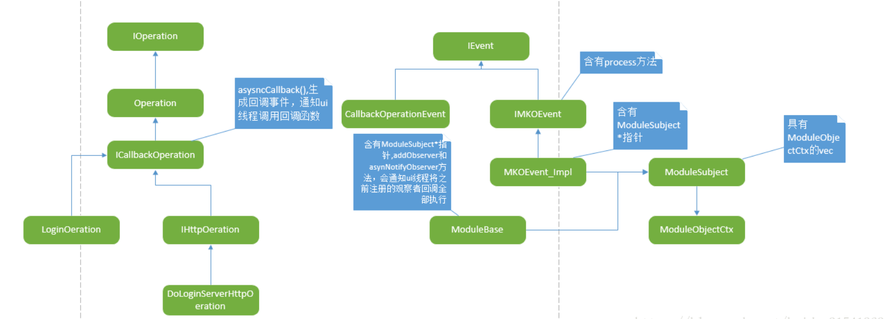

# 逻辑队列&代理窗口&http队列

---

客户端主要框架是两个任务队列，四个线程，分别为逻辑任务队列（处理业务逻辑任务）、http任务队列（处理http有关的业务），

每个队列有一个对应的线程，http队列有一个线程池，默认线程池线程个数为1，还有一个网络IO线程负责处理IO数据的读写操作，主线程做界面消息循环，用来与用户交互，之前分析过Io线程是进行数据

下面就分析下这些队列和逻辑

### 1.逻辑队列实现方式

逻辑队列的启动方式，OperationManager::startup()启动逻辑队列处理线程，进行while循环处理std::list

```cpp
IMCoreErrorCode OperationManager::startup()
{
    m_operationThread = std::thread([&]
    {
        std::unique_lock <std::mutex> lck(m_cvMutex);
        Operation* pOperation = nullptr;
        while (m_bContinue)
        {
            if (!m_bContinue)
                break;
            if (m_vecRealtimeOperations.empty())
                m_CV.wait(lck);//没有任务，线程进行条件等待
            if (!m_bContinue)
                break;
            {
                std::lock_guard<std::mutex> lock(m_mutexOperation);
                if (m_vecRealtimeOperations.empty())
                    continue;
                pOperation = m_vecRealtimeOperations.front();
                m_vecRealtimeOperations.pop_front();
            }
            if (!m_bContinue)
                break;
            if (pOperation)
            {
                pOperation->process();//有任务，任务出队，调用任务的process函数处理
                pOperation->release();//处理完即自己释放掉
            }
        }
    });
    return IMCORE_OK;
}

void Operation::process()
{
    try
    {
        m_state = OPERATION_RUNNING;
        processOpertion();这是一个纯虚函数，该类是抽象类，不同任务类继承该类，并重写该函数，处理不同的逻辑任务
    }
    catch (Exception& exc)
    {
        assert(false);
        LOG__(ERR, _T("process exception,reason:%s"),exc.what());
    }
    catch (std::exception& exc)
    {
        assert(false);
        LOG__(ERR, _T("process exception,reason:%s"), exc.what());
    }
    catch (...)
    {
        assert(false);
        LOG__(ERR, _T("process unknown exception"));
    }
    m_state = OPERATION_FINISHED;
}
```

OperationManager作为任务管理类，拥有这个逻辑队列，并可以对逻辑任务队列进行添加删除任务，

添加任务有两种方式，普通插入添加startOperation，和使用lambda表达式添加startOperationWithLambda


### 2.ui代理窗口事件处理与模块通信

客户端将一些功能抽象成<font color='#BAOC2F'>模块组件</font>，如登录模块、组模块、会话模块等，

有些模块是后台信息保存和处理的模块，逻辑任务线程进行对其操作，有些模块涉及界面的一些数据，ui代理线程对其操作，

类似于mfc里的文档与视图，这里的后台模块与界面也会进行通信，但这个数据流通的方式比前面讲述的单独的asyncCallback异步通知要为复杂

下面是简单画的一个草图，用来理清类之间的关系



模块基础类
1. IEvent : 事件基类
2. ITimerEvent : 定时器基类
3. IMKOEvent :观察事件基类
4. MKOEvent : 观察事件实现类，处理观察事件
5. ModuleObserverCtx : 观察者信息保存类，有回调函数
6. ModuleSubject : 通知者，通知所有观察者
7. CallbackOperationEvent : 继承于IEvent，封装回调函数的事件
8. ICallbackPertaion : 继承Operation ， 封装对回调事件的操作
9. ModuleBase : 封装对ModuleSubject的操作
10. UIEventManager : UI事件管理类，负责事件的通知和事件处理

之前的CallbackOperationEvent和IMKOEvent都是继承于IEvent，并进行重写process方法，

而各个后台模块都是ModuleBase的基类，每个模块都拥有ModuleSubject的指针，可以进行添加观察者，这里使用的是观察者模式，如后台数据的变化会导致多个界面或者多个地方会发生改变，

1. 此时ModuleBase类通过添加需要改变的类，然后进行通知，
2. 将MKOEvent_Impl事件给ui代理线程，ui线程将调用MKOEvent_Impl的process，
3. 在process中调用ModuleSubject中的每个ModuleObjectCtx中的回调函数，这样就完成了后台数据发生变化可以通知到多个地方的操作，

上面讲的比较粗像类，似于思路提示作用，看客户端代码时候<font color='#BAOC2F'>许多业务都会涉及到这种通知方式</font>，可以进行调试下即可


### 3.http队列实现方式

这个http队列线程启动方式在之前的概述中也没有讲到，因为http队列线程是在点击登录界面中的登录按钮的时候才会进行启动

```cpp
void LoginDialog::OnClick(TNotifyUI& msg)
{
    PTR_VOID(msg.pSender);
    if (msg.pSender == m_pBtnLogin)
    {
        _DoLogin();//如果是登录按钮点击，则进行登录操作
        return;
    }
    else if (msg.pSender == m_pBtnSysSetting)
    {
        module::getSysConfigModule()->showServerConfigDialog(m_PaintManager.GetPaintWindow());
        return;
    }
    __super::OnClick(msg);
}
```

```cpp
void LoginDialog::_DoLogin()
{
    LOG__(APP,_T("User Clicked LoginBtn"));
    m_ptxtTip->SetText(_T(""));
    CDuiString userName = m_pedtUserName->GetText();
    CDuiString password = m_pedtPassword->GetText();
    if (userName.IsEmpty())
    {
        CString csTip = util::getMultilingual()->getStringById(_T("STRID_LOGINDIALOG_USERNAME_EMPTY"));
        m_ptxtTip->SetText(csTip);
        return;
    }
    if (password.IsEmpty())
    {
        CString csTip = util::getMultilingual()->getStringById(_T("STRID_LOGINDIALOG_PASSWORD_EMPTY"));
        m_ptxtTip->SetText(csTip);
        return;
    }
    module::TTConfig* pCfg = module::getSysConfigModule()->getSystemConfig();
    pCfg->userName = userName;
    if (m_bPassChanged)
    {
        std::string sPass = util::cStringToString(CString(password));
        char* pOutData = 0;
        uint32_t nOutLen = 0;
        int retCode = EncryptPass(sPass.c_str(), sPass.length(), &pOutData, nOutLen);
        if (retCode == 0 && nOutLen > 0 && pOutData != 0)
        {
            pCfg->password = std::string(pOutData, nOutLen);
            Free(pOutData);
        }
        else
        {
            LOG__(ERR, _T("EncryptPass Failed!"));
            CString csTip = util::getMultilingual()->getStringById(_T("STRID_LOGINDIALOG_LOGIN_ENCRYPT_PASE_FAIL"));
            m_ptxtTip->SetText(csTip);            
            return;
        }
    }
    pCfg->isRememberPWD = m_pChkRememberPWD->GetCheck();
    module::getSysConfigModule()->saveData();
    CString csTxt = util::getMultilingual()->getStringById(_T("STRID_LOGINDIALOG_BTN_DOLOGIN"));
    m_pBtnLogin->SetText(csTxt);
    m_pBtnLogin->SetEnabled(false);
   //上面进行用户名密码获取等一系列登录准备操作

    //连接登陆服务器
    DoLoginServerParam param;
   //DoLoginServerHttpOperation这个继承于IHttpOperation，IHttpOperation又继承于ICallbackOpertaion，ICallbackOpertaion继承自Operation
    DoLoginServerHttpOperation* pOper = new DoLoginServerHttpOperation(
        BIND_CALLBACK_1(LoginDialog::OnHttpCallbackOperation), param);
    module::getHttpPoolModule()->pushHttpOperation(pOper);//如果这时没有http任务队列处理线程，会进行启动对应数量的线程
}
```

DoLoginServerHttpOperation继承自Operation，

自然知道这个任务类可以重写了processOpertion()，暂时不看这个函数做了什么，去看下http任务处理线程怎么启动的

#### TTHttpThread::process()

```cpp
void HttpPoolModule_Impl::pushHttpOperation(module::IHttpOperation* pOperaion, BOOL bHighPriority /*= FALSE*/)
{
    if (NULL == pOperaion)
    {
        return;
    }
    CAutoLock lock(&m_mtxLock);
    if (bHighPriority)
        m_lstHttpOpers.push_front(pOperaion);
    else
        m_lstHttpOpers.push_back(pOperaion);
    _launchThread();//启动线程函数
    ::ReleaseSemaphore(m_hSemaphore, 1, NULL);
    return;
}

BOOL HttpPoolModule_Impl::_launchThread()
{
    if ((int)m_vecHttpThread.size() >= MAX_THEAD_COUNT)//每次入队任务的时候都会进行线程大小的检查，不够就进行增加，默认为1
    {
        return TRUE;
    }
    TTHttpThread* pThread = new TTHttpThread();
    PTR_FALSE(pThread);
    if (!pThread->create())//这里调用TTHttpThread的process函数，具体怎么启动的调试进入代码可以看到
    {
        return FALSE;
    }
    Sleep(300);
    m_vecHttpThread.push_back(pThread);
    return TRUE;
}

UInt32 TTHttpThread::process()
{
    module::IHttpOperation * pHttpOper = NULL;
    HttpPoolModule_Impl *pPool = m_pInstance;
    while (m_bContinue)
    {
        if (WAIT_OBJECT_0 != ::WaitForSingleObject(pPool->m_hSemaphore, INFINITE))
        {
            break;
        }
        if (!m_bContinue)
        {
            break;
        }
        {
            CAutoLock lock(&(pPool->m_mtxLock));
            if (pPool->m_lstHttpOpers.empty())
                pHttpOper = NULL;
            else
            {
                pHttpOper = pPool->m_lstHttpOpers.front();
                pPool->m_lstHttpOpers.pop_front();
            }
        }
        try
        {
            if (m_bContinue && pHttpOper)
            {
                pHttpOper->process();//进行具体任务的处理
                pHttpOper->release();
            }
        }
        catch (...)
        {
            LOG__(ERR, _T("TTHttpThread: Failed to execute opertaion(0x%p)"), pHttpOper);
        }
    }
    return 0;
}
```

TTHttpThread::process()这里进行while循环处理http队列里的http任务

pHttpOper->process();这里最后会调用该操作类的processOpertion函数，回调之前那个`DoLoginServerHttpOperation* pOper = new DoLoginServerHttpOperation(BIND_CALLBACK_1(LoginDialog::OnHttpCallbackOperation), param);`构造http任务类的地方，

这里http任务入队后，会被http线程调用他的processOpertion函数，

#### DoLoginServerHttpOperation::processOpertion

```cpp
void DoLoginServerHttpOperation::processOpertion()
{
    module::TTConfig* pCfg = module::getSysConfigModule()->getSystemConfig();
    LOG__(APP, _T("loginAddr = %s"), pCfg->loginServIP);
    std::string& loginAddr = util::cStringToString(pCfg->loginServIP);
    std::string url = loginAddr;

    DoLoginServerParam* pPamram = new DoLoginServerParam();
    pPamram->resMsg = util::getMultilingual()->getStringById(_T("STRID_LOGINDIALOG_LOGIN_HTTP_DEFERROR"));
    Http::HttpResponse    response;
    Http::HttpClient    client;
    Http::HttpRequest    request("get", url);
    if (!client.execute(&request, &response))
    {
        CString csTemp = util::stringToCString(url);
        pPamram->result = DOLOGIN_FAIL;
        LOG__(ERR,_T("failed %s"), csTemp);
        asyncCallback(std::shared_ptr<void>(pPamram));
        client.killSelf();
        return;
    }
    std::string body = response.getBody();
    client.killSelf();
    //json解析
    try
    {
        Json::Reader reader;
        Json::Value root;
        if (!reader.parse(body, root))
        {
            CString csTemp = util::stringToCString(body);
            LOG__(ERR, _T("parse data failed,%s"), csTemp);
            pPamram->result = DOLOGIN_FAIL;
            pPamram->resMsg = util::getMultilingual()->getStringById(_T("STRID_LOGINDIALOG_LOGIN_HTTP_JSONERROR"));
            goto End;
        }
        int nCode = root.get("code", "").asInt();
        if (0 == nCode)//登陆成功
        {
            LOG__(APP, _T("get msgSvr IP succeed!"));
            pCfg->msgSevPriorIP = root.get("priorIP", "").asString();
            pCfg->msgSevBackupIP = root.get("backupIP", "").asString();
            std::string strPort = root.get("port", "").asString();
            pCfg->msgServPort = util::stringToInt32(strPort);
            pCfg->fileSysAddr = util::stringToCString(root.get("msfsPrior", "").asString());
            pCfg->fileSysBackUpAddr = util::stringToCString(root.get("msfsBackup", "").asString());
            pPamram->result = DOLOGIN_SUCC;
        }
        else
        {
            LOG__(ERR, _T("get msgSvr IP failed! Code = %d"),nCode);
            pPamram->result = DOLOGIN_FAIL;
            CString csRetMsgTemp = util::stringToCString(root.get("msg", "").asString());
            if (!csRetMsgTemp.IsEmpty())
                pPamram->resMsg = csRetMsgTemp;
        }
    }
    catch (...)
    {
        CString csTemp = util::stringToCString(body);
        LOG__(ERR,_T("parse json execption,%s"), csTemp);
        pPamram->result = DOLOGIN_FAIL;
        pPamram->resMsg = util::getMultilingual()->getStringById(_T("STRID_LOGINDIALOG_LOGIN_HTTP_JSONERROR"));
    }
End:
    asyncCallback(std::shared_ptr<void>(pPamram));//异步通知ui代理窗口线程调用回调函数
}
```

这里这个函数的的具体作用就是对登录服务器发送http请求，获取到具体的消息服务器的ip和端口，然后根据这个ip和端口进行真正的登录消息服务器进行通信，

这里不过多的讨论业务方面的东西，那些东西可以自行摸索，有些业务我不是参与者我只是学习者，也没有完全掌握，

这里只是作为一个代码学习，对它的框架结构的一个分析，这个笔记在看源码的时候可以进行参考，并不能直接帮你解读。

#### asyncCallback

DoLoginServerHttpOperation::processOpertion()中成功获取到所想要的服务器的地址后，

通过asyncCallback(std::shared_ptr(pPamram));来进行一个异步通知，

这个异步通知最后会在ui代理窗口的过程函数中被处理，即之前的构造函数中注册的回调函数，会在ui线程中进行调用。

```cpp
void asyncCallback(std::shared_ptr<void> param)
    {
        CallbackOperationEvent* pEvent = new CallbackOperationEvent(m_callback, param);
        module::getEventManager()->asynFireUIEvent(pEvent);
    }
```

##### CallbackOperationEvent->process

看CallbackOperationEvent中的process方法

```cpp
virtual void process()
    {
        m_callback(m_param);
    }
```

##### module::getEventManager()->asynFireUIEvent(pEvent);

而上述中的module::getEventManager()->asynFireUIEvent(pEvent);会给ui代理窗口发送消息，这个消息在消息队列中被ui线程进行获取处理

```cpp
module::IMCoreErrorCode UIEventManager::asynFireUIEvent(IN const IEvent* const pEvent)
{
    assert(m_hWnd);
    assert(pEvent);
    if (0 == m_hWnd || 0 == pEvent)
        return IMCORE_ARGUMENT_ERROR;
    if (FALSE == ::PostMessage(m_hWnd, UI_EVENT_MSG, reinterpret_cast<WPARAM>(this), reinterpret_cast<WPARAM>(pEvent)))
        return IMCORE_WORK_POSTMESSAGE_ERROR;
    return IMCORE_OK;
}
//客户端概述中讲过ui代理窗口处理任务的过程，这里就带过
LRESULT _stdcall UIEventManager::_WindowProc(HWND hWnd
                                            , UINT message
                                            , WPARAM wparam
                                            , LPARAM lparam)
{
    switch (message)
    {
    case UI_EVENT_MSG:
        reinterpret_cast<UIEventManager*>(wparam)->_processEvent(reinterpret_cast<IEvent*>(lparam), TRUE);
        break;
    case WM_TIMER:
        reinterpret_cast<UIEventManager*>(wparam)->_processTimer();
        break;
    default:
        break;
    }
    return ::DefWindowProc(hWnd, message, wparam, lparam);
}

void UIEventManager::_processEvent(IEvent* pEvent, BOOL bRelease)
{
    assert(pEvent);
    if (0 == pEvent)
        return;
    try
    {
        pEvent->process();
        if (bRelease)
            pEvent->release();
    }
   ......
}
```

#### OnHttpCallbackOperation

最终CallbackOperationEvent中的回调会在这个process中调用，而CallbackOperationEvent中的回调是之前构造的时候进行注册的OnHttpCallbackOperation

```cpp
void LoginDialog::OnHttpCallbackOperation(std::shared_ptr<void> param)
{
    DoLoginServerParam* pParam = (DoLoginServerParam*)param.get();
    if (DOLOGIN_SUCC == pParam->result)
    {
        module::TTConfig* pCfg = module::getSysConfigModule()->getSystemConfig();
        PTR_VOID(pCfg);
        LoginParam loginparam;
        loginparam.csUserName = pCfg->userName;
        loginparam.password = pCfg->password;
        loginparam.csUserName.Trim();
        //将操作任务进行入逻辑队列，等待逻辑任务线程处理
        LoginOperation* pOperation = new LoginOperation(
            BIND_CALLBACK_1(LoginDialog::OnOperationCallback), loginparam);
        imcore::IMLibCoreStartOperation(pOperation);
    }
    else
    {
        m_ptxtTip->SetText(pParam->resMsg);
        module::TTConfig* pCfg = module::getSysConfigModule()->getSystemConfig();
        LOG__(ERR, _T("get MsgServer config faild,login server addres:%s:%d"), pCfg->loginServIP,pCfg->loginServPort);
        CString csTxt = util::getMultilingual()->getStringById(_T("STRID_LOGINDIALOG_BTN_LOGIN"));
        m_pBtnLogin->SetText(csTxt);
        m_pBtnLogin->SetEnabled(true);
    }
}
```

OnHttpCallbackOperation由ui代理窗口调用，然后注册的OnOperationCallback最后由任务逻辑队列进行调用，这里还是重复的或者业务逻辑的东西都进行跳过

#### http队列实现方式总结

1. 这里总结下这个小结，这个小结是讲http任务队列的实现方式，主要是启动http任务线程进行循环处理队列中的http任务，
2. 而这个http任务可能是Ui线程投入的，有的是逻辑任务线程投入的，使用的任务类都是继承自ICallbackOpertaion，
3. 它会最后调用之前注册的回调函数，


ui代理窗口线程处理任务的实现方式有一种跟这个类似，

如CallbackOperationEvent继承自ICallbackOpertaion，然后ui代理窗口会调用之前注册的回调函数，

只是和http队列不一样的是，

- 入队是通过发送消息，队列是系统的消息队列，并没有额外启动线程进行循环处理，而是利用duilib的消息机制，
- 另外ui窗口进行事件处理并不只是这一种异步通知的方式进行处理事件，下面接着看


